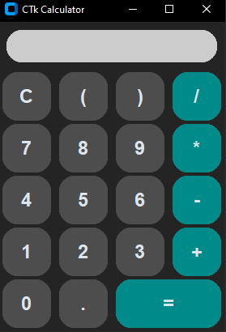

# Custom Tkinter Calculator

A simple calculator application built using Python's Tkinter library with custom-styled buttons.

## Features

- Arithmetic operations: Addition, Subtraction, Multiplication, Division
- Parentheses for complex expressions
- Decimal point for floating-point numbers
- Error handling for division by zero
- Clear button to reset the calculator
- Responsive design with custom-styled buttons

## Customization

You can customize the appearance of the calculator by modifying the attributes of the buttons in the `main.py` script.
